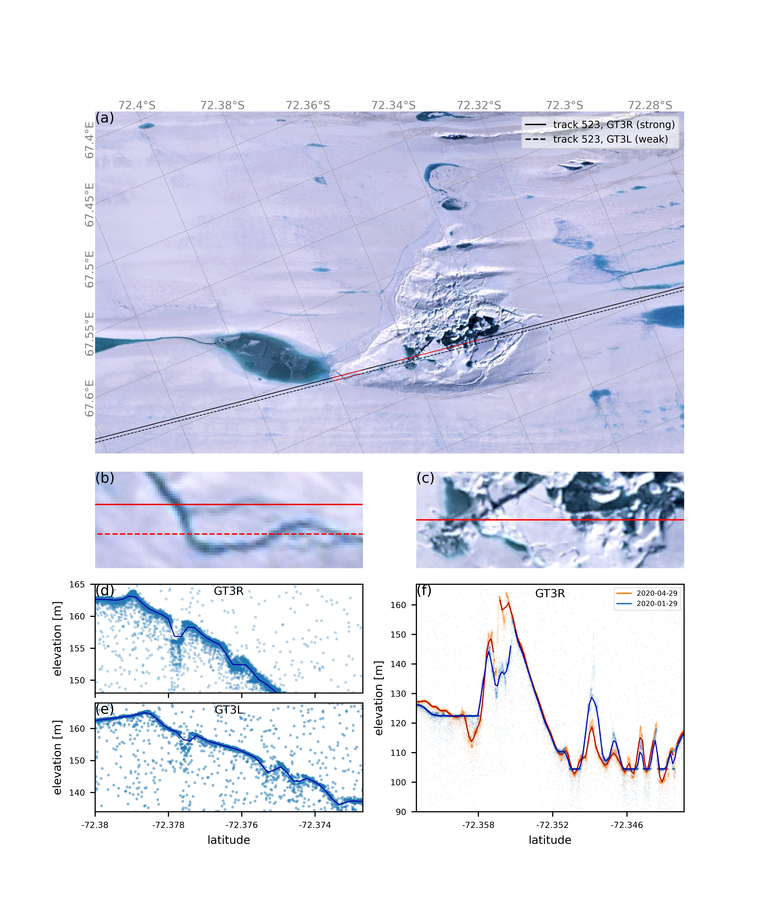

# Rapid formation of an ice doline on Amery Ice Shelf, East Antarctica

Surface melting over Antarctica’s floating ice shelves is predicted to increase significantly
during coming decades, but the implications for their stability are unknown. The Antarctic 
Peninsula has already seen meltwater driven ice shelf collapses. We are still learning how 
meltwater forms, flows and alters the surface, and rapid water-driven changes are not limited to 
summer. We present high-resolution satellite data (imagery and altimetry) showing an abrupt 
change on East Antarctica’s Amery Ice Shelf in June 2019 (midwinter). An 18 km2 ice-covered 
meltwater lake drained through to the ocean below, leaving a deep, uneven 10 km2 depression of 
fractured ice (a “doline”) in the ice shelf surface. The reduced load on the floating ice resulted in 
flexure, with uplift of over 20 m around the former lake. Using an elastic flexure model, we 
showed that this corresponds to about 0.75 km3 of water being lost to the ocean. ICESat-2 
observations in summer 2020 profiled a new narrow channel inside the doline as meltwater 
started refilling it from a new lake created by the flexure. ICESat-2’s capacity to observe surface 
processes at small spatial scales greatly improves our ability to model them, ultimately 
improving the accuracy of our projections.

 
