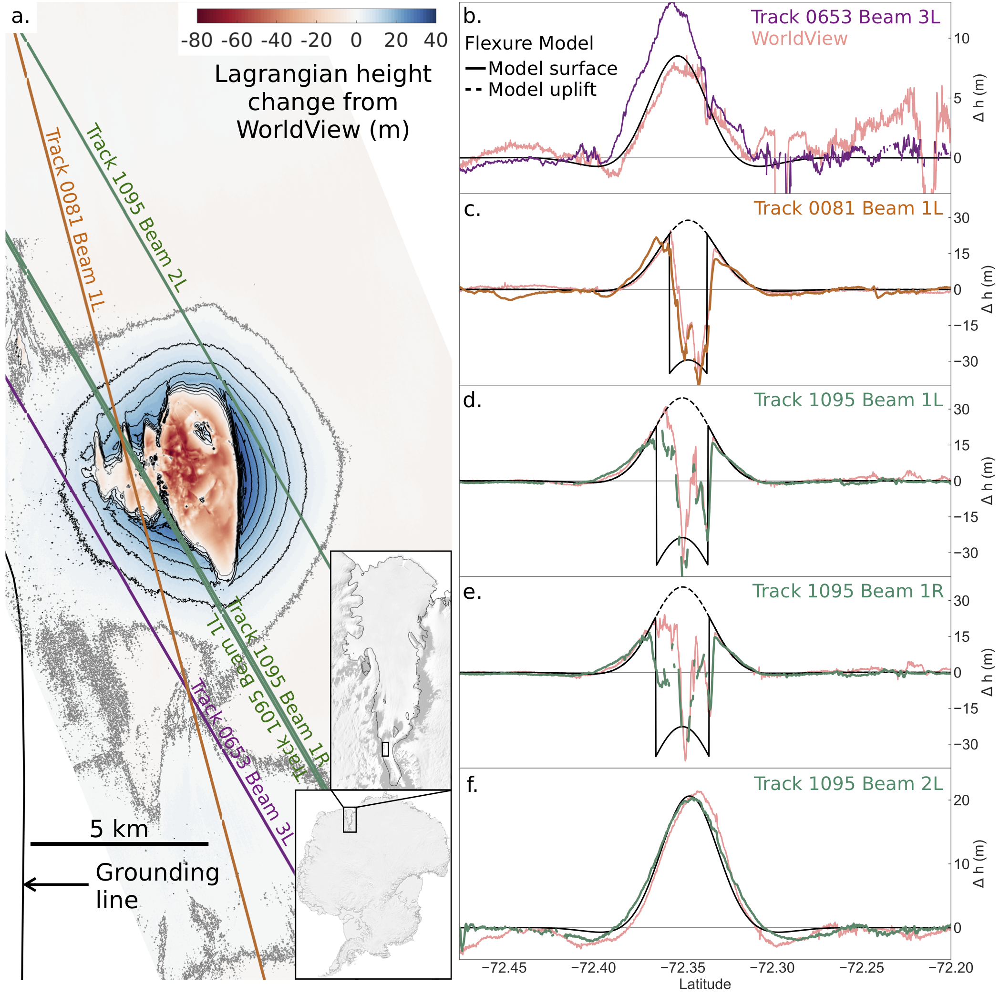

# Rapid formation of an ice doline on Amery Ice Shelf, East Antarctica

## Key Points:
- Satellite images showed an 11 km2 depression on Amery Ice Shelf as an ice-covered lake drained abruptly in winter 2019 forming an ice doline
- ICESat-2 and WorldView data show elevation fell as much as 80 m in the depression, amidst 60 km2 of hydrostatic rebound and uplift over 36 m
- ICESat-2 photon data profiled a new meltwater channel, incised when a lake formed by the flexural uplift overflowed into the doline in 2020

## Plain Language Summary:

Surface melting over Antarctica’s floating ice shelves is predicted to increase significantly during coming decades, but the implications for their stability are unknown. The Antarctic Peninsula has already seen meltwater driven ice shelf collapses. We are still learning how meltwater forms, flows and alters the surface, and that rapid water-driven changes are not limited to summer. We present high-resolution satellite data (imagery and altimetry) showing an abrupt change on East Antarctica’s Amery Ice Shelf in June 2019 (midwinter). Meltwater stored in a deep, ice-covered lake drained through to the ocean below, leaving a deep, uneven 11 km2 depression of fractured ice (a “doline”) in the ice shelf surface. The reduced load on the floating ice shelf resulted in flexure, with over 36 m of uplift centered on the former lake. Simple flexure modeling showed that this corresponds to about 0.75 km3 of water being lost to the ocean. ICESat-2 observations in summer 2020 profiled a new narrow channel inside the doline as meltwater started refilling it from a new lake created by the flexure. ICESat-2’s capacity to observe surface processes at small spatial scales greatly improves our ability to model them, ultimately improving the accuracy of our projections.

## Contents:
1. **Main Scripts**
    - [Fig1_formation_of_doline_on_Amery_Ice_Shelf.ipynb](/Fig1_formation_of_doline_on_Amery_Ice_Shelf.ipynb): Jupyter notebook that outputs Fig. 1 in the paper. 
    - [Fig2_height_change_profiles.ipynb](/Fig2_height_change_profiles.ipynb): Jupyter notebook that outputs elevation profile comparisons for Fig. 2 in the paper.
    - [Fig3_first_melt_season_after_doline_formation.ipynb](/Fig3_first_melt_season_after_doline_formation.ipynb): Jupyter notebook that outputs Fig. 3 in the paper. 
2. **Directories**
    - [data/IS2/](/data/IS2/): Contains pickle files with all the relevant ICESat-2 data. Data can also be read in from the corresponding .h5 files, which are available from [NSIDC](https://nsidc.org/data/icesat-2/data-sets). Also contains a matlab file of profiles on ICEsat-2 tracks from ice shelf flexure modelling.   
    - [data/L8/](/data/L8/): Contains the Landsat 8 data used for Figs 1 and 3. The mosaic for Fig 1 is in the main folder, the pan-sharpened and windowed images for Figures 1 and 3 are in the [pansharpened](/data/L8/pansharpened/) subdirectory.
    - [data/siogz/](/data/siogz/): Contains grounding line data for plotting maps in Fig 1.
    - [figs/](/figs/): Contains the figures / output from the main scripts.
    - [readers/](/readers/): Contains helper functions to read ICESat-2 data from .h5 files to Python dictionaries. 
3. **Helper functions / code**
    - [0_process_L8_pansharpening.ipynb](/0_process_L8_pansharpening.ipynb): Jupyter notebook that reads the required Landsat 8 image files directly from S3, pan-sharpens and windows them, and writes them to files. This was used to produce the files in *data/L8/pansharpened*
    - [mosaic_windowing_downsampling.ipynb](/mosaic_windowing_downsampling.ipynb): Contains code to create smaller Landsat-8 mosaic files from a massive image that is too large and inconvenient to put on github.
    - [curve_intersect.py](/curve_intersect.py): A helper function that is needed to label the graticule on the maps produced.

**Additional data:**
The Worldview-3-based DEMs used to produce the Lagrangian height change shown in panel (a) of figure 2 will be archived together with this code at Zenodo at *[data/](/data/)amery_doline_worldview.h5*. The corresponding DOI will be provided on GitHub as soon as it is issued. 
~~~
Fields in the hdf5 file amery_doline_worldview.h5:
x_dem, PS-71 x in m for 8m WorldView DEMs
y_dem, PS-71 y in m for 8m WorldView DEMs
dem_1, 8m WorldView DEM, acquired 2018-03-26, ref: WV01_20180326_10200100702AF500_1020010070B54500_2m_lsf_seg1
dem_2, 8m WorldView DEM, acquired 2019-12-20, ref: WV03_20191220_1040010056100500_1040010055740B00_2m_lsf_seg1
x_DhDt, PS-71 x in m for 16m Lagrangian Dh/Dt between DEM 1 and DEM 2
y_DhDt, PS-71 y in m for 16m Lagrangian Dh/Dt between DEM 1 and DEM 2
DhDt, Lagrangian Dh/Dt between DEM 1 and DEM 2, referenced to DEM 1
~~~

**Figure 1.**  Formation of doline on Amery Ice Shelf. a) Landsat 8 image over the southern Amery Ice Shelf on 17 January 2019; Landsat 8 images for (b) 31 March and (c) 14 September 2019, with color-coded ICESat-2 GTs overlaid; (d) to (k) ICESat-2 ATL06 data for repeats of GTs (from west to east) before and after doline formation.

**Figure 2.** Elevation changes and estimation of unloading by the drainage event. a): Elevation changes for the doline and surrounding ice shelf from Lagrangian differencing of WorldView DEMs (26 March 2018 and 20 December 2019). Contours for positive changes: 5 m interval, zero contour in grey, overlaid with locations of ICESat-2 GTs. (b) to (f): ATL06 elevation difference profiles from ICESat-2 GTs (from west to east), with corresponding profiles from the WorldView DEM difference and flexural modelling. *Imagery ©️ 2020 DigitalGlobe, Inc.*

 
**Figure 3:** First melt season after doline formation (2019/2020). a) Landsat 8 image 29 January 2020 #126/111; ICESat-2 Tracks 0523 GT3L and GT3R are shown; (b and c) zooms of Landsat 8 image; ICESat-2 ATL03 and ATL06 data (d and e) for Track 0523 GT3L and GT3R across a drainage channel (at -72.378o) incised by meltwater flow from the rebound lake to the doline; f) for Track 0523 GT3R across the doline in January and April 2020 showing the structure of the collapsed ice lid and meltwater surfaces at 122.4 and 104.5 m; the April track is displaced to align major features with the January profile.
